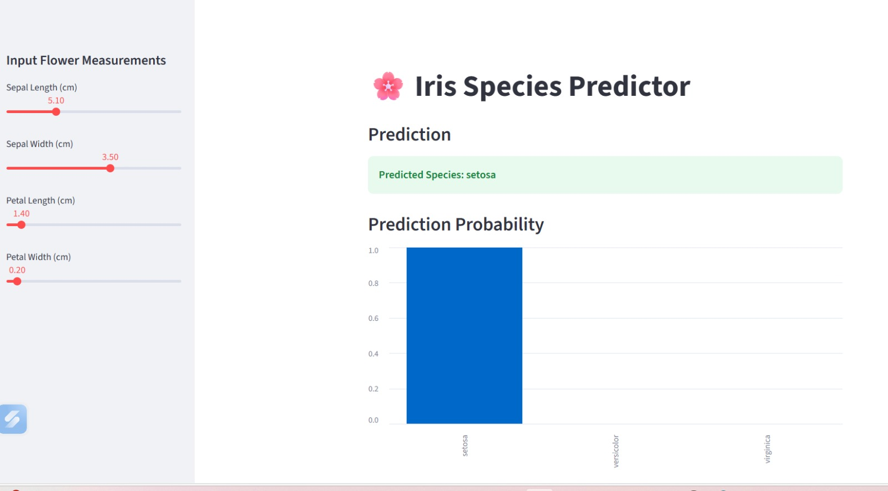

# 🌸 Iris Species Predictor

ML web app that predicts Iris flower species using RandomForest + Streamlit

## Demo


## Tech Stack
- Python
- Scikit-learn
- Streamlit 
- NumPy

## Run Locally
```bash
pip install streamlit scikit-learn numpy
streamlit run iris_streamlit.py
